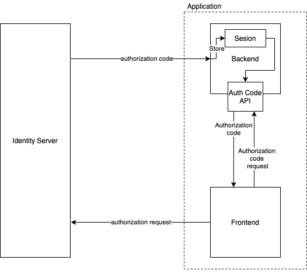

# Asgardeo JavaScript SPA SDK


[](https://stackoverflow.com/questions/tagged/wso2is)
[](https://join.slack.com/t/wso2is/shared_invite/enQtNzk0MTI1OTg5NjM1LTllODZiMTYzMmY0YzljYjdhZGExZWVkZDUxOWVjZDJkZGIzNTE1NDllYWFhM2MyOGFjMDlkYzJjODJhOWQ4YjE)
[](https://github.com/wso2/product-is/blob/master/LICENSE)
[](https://twitter.com/intent/follow?screen_name=wso2)

---

## Table of Content

-   [Introduction](#introduction)
-   [Install](#install)
-   [Getting Started](#getting-started)
    -   [Using an Embedded Script](#using-an-embedded-script)
    -   [Using a Module](#using-a-module)
-   [Try Out the Sample Apps](#try-out-the-sample-apps)
-   [Browser Compatibility](#browser-compatibility)
-   [APIs](#apis)
    -   [getInstance](#getinstance)
    -   [initialize](#initialize)
    -   [getBasicUserInfo](#getBasicUserInfo)
    -   [signIn](#signin)
    -   [signOut](#signout)
    -   [httpRequest](#httpRequest)
    -   [httpRequestAll](#httpRequestAll)
    -   [requestCustomGrant](#requestCustomGrant)
    -   [revokeAccessToken](#revokeAccessToken)
    -   [getOIDCServiceEndpoints](#getOIDCServiceEndpoints)
    -   [getDecodedIDToken](#getdecodedidtoken)
    -   [getAccessToken](#getaccesstoken)
    -   [refreshAccessToken](#refreshAccessToken)
    -   [on](#on)
    -   [isAuthenticated](#isAuthenticated)
    -   [enableHttpHandler](#enableHttpHandler)
    -   [disableHttpHandler](#disableHttpHandler) -[updateConfig](#updateConfig) -[getHttpClient](#getHttpClient)
-   [Using the `form_post` Response Mode](#using-the-form_post-response-mode)
-   [Storage](#storage)
-   [Models](#Models)
    -   [AuthClientConfig\<Config>](#AuthClientConfig<Config>)
    -   [BasicUserInfo](#BasicUserInfo)
    -   [SignInConfig](#SignInConfig)
    -   [OIDCEndpoints](#OIDCEndpoints)
    -   [CustomGrantConfig](#CustomGrantConfig)
    -   [Custom Grant Template Tags](#Custom-Grant-Template-Tags)
    -   [DecodedIDTokenPayload](#DecodedIDTokenPayload)
-   [Develop](#develop)
    -   [Prerequisites](#prerequisites)
    -   [Installing Dependencies](#installing-dependencies)
-   [Contribute](#contribute)
-   [License](#license)

## Introduction

Asgardeo Auth SPA SDK for JavaScript allows Single Page Applications to use OIDC or OAuth2 authentication in a simple and secure way. By using Asgardeo and the JavaScript SPA SDK, developers will be able to add identity management to their Single Page Applications in a jiffy.

## Install

Install the JavaScript library from the npm registry.

```
npm install --save @asgardeo/auth-spa
```

Or simply load the SDK by importing the script into the header of your HTML file.

```html
<script src="https://unpkg.com/@asgardeo/auth-spa@0.1.26/dist/asgardeo-spa.production.min.js.js"></script>

<script>
    var auth = AsgardeoAuth.AsgardeoSPAClient.getInstance();
</script>
```

## Getting Started

### Using an Embedded Script

```TypeScript
// This client is a class and can be instantiated as follows.
var auth = AsgardeoAuth.AsgardeoSPAClient.getInstance();

// Once instantiated, the  client can be initialized by passing the relevant parameters such as the server origin, redirect URL, client ID, etc.
auth.initialize({
     signInRedirectURL: "http://localhost:3000/sign-in",
     signOutRedirectURL: "http://localhost:3000/dashboard",
     clientID: "client ID",
     serverOrigin: "https://localhost:9443"
});

// To sign in, simply call the `signIn()` method.
auth.signIn();

// The `sign-in` hook is used to fire a callback function after signing in is successful.
auth.on("sign-in", (response) => {
    alert("You have successfully signed in!");
});

```

### Using a Module

```TypeScript
// The SDK provides a client that can be used to carry out the authentication.
import { AsgardeoSPAClient } from "@asgardeo/auth-spa";

// This client is a class and can be instantiated as follows.
const auth = AsgardeoSPAClient.getInstance();

// Once instantiated, the  client can be initialized by passing the relevant parameters such as the server origin, redirect URL, client ID, etc.
auth.initialize({
     signInRedirectURL: "http://localhost:3000/sign-in",
     signOutRedirectURL: "http://localhost:3000/dashboard",
     clientID: "client ID",
     serverOrigin: "https://localhost:9443"
});

// To sign in, simply call the `signIn()` method.
auth.signIn();

// The `sign-in` hook is used to fire a callback function after signing in is successful.
auth.on("sign-in", (response) => {
    alert("You have successfully signed in!");
});

```

[Learn more](#apis).

## Try Out the Sample Apps

### 1. Create a Service Provider

Before trying out the sample apps, you need to a create a service provider in the Identity Server.

1. So, navigate to `https://localhost:9443/carbon" and click on `Add`under`Service Providers` in the left-hand menu panel.

2. Enter `Sample` as the name of the app and click on `Register`.

3. Then, expand the `Inbound Authentication Configuration` section. Under that, expand `OAuth/OpenID Connect Configuration` section and click on `Configure`.

4. Under `Allowed Grant Types` uncheck everything except `Code` and `Refresh Token`.

5. Enter the Callback URL(s). You can find the relevant callback URL(s) of each sample app in the [Running the sample apps](#2.-running-the-sample-apps) section.

6. Check `Allow authentication without the client secret`.

7. Click `Add` at the bottom.

8. Copy the `OAuth Client Key`.

9. Enable CORS for the client application by following this guide (https://is.docs.wso2.com/en/5.11.0/learn/cors/).

### 2. Running the sample apps

Build the apps by running the following command at the root directory.

```
npm run build
```

#### 1. HTML JavaScript Sample

The *Callback URL* of this app is `http://localhost:3000`.

You can try out the HTML JavaScript Sample App from the [samples/html-js-app](../../samples/using-oidc-js-sdk/html-js-app). The instructions to run the app can  be found [here](/samples/vanilla-js-app/README.md)

#### 2. React Typescript Sample

The *Callback URL* of this app is `http://localhost:3000`.

You can try out the React Sample App from the [samples/react-typescript-app](../../samples/using-oidc-js-sdk/react-typescript-app). The instructions to run the app can  be found [here](/samples/react-js-app/README.md)

#### 2. Java Webapp Sample

The *Callback URL* of this app is the URL of this app on the server. For instance, if your Tomcat server is running on `http://localhost:8080`, then the callback URL will be `http://localhost:8080/java-webapp`.

You can try out the Java Webapp Sample App from the [samples/java-webapp](../../samples/using-oidc-js-sdk/java-webapp). The instructions to run the app can  be found [here](/samples/java-webapp/README.md)

## Browser Compatibility

The SDK supports all major browsers and provides polyfills to support incompatible browsers. If you want the SDK to run on Internet Explorer or any other old browser, you can use the polyfilled script instead of the default one.

To embed a polyfilled script in an HTML page:

```html
<script src="https://unpkg.com/@asgardeo/auth-spa@0.1.26/dist/polyfilled/asgardeo-spa.production.min.js.js"></script>
```

You can also import a polyfilled module into your modular app. Asgardeo provides two different modules each supporting UMD and ESM.
You can specify the preferred module type by appending the type to the module name as follows.

To import a polyfilled ESM module:

```TypeScript
import { AsgardeoSPAClient } from "@asgardeo/auth-spa/polyfilled/esm";
```

To import a polyfilled UMD module:

```TypeScript
import { AsgardeoSPAClient } from "@asgardeo/auth-spa/polyfilled/umd";
```

**Note that using a polyfilled modules comes at the cost of the bundle size being twice as big as the default, non-polyfilled bundle.**

**_A Web Worker cannot be used as a storage option in Internet Explorer as the browser doesn't fully support some of the modern features of web workers._**

## APIs

### getInstance

```typescript
getInstance(id?: string): AsgardeoSPAClient;
```

#### Arguments

1. id: `string`
   The id of the instance. If you need to create only one instance, then this is optional.

#### Returns

An instance of the `AsgardeoSPAClient`.

#### Description

This returns a static instance of the `AsgardeoSPAClient`. The SDK allows you to create multiple instances of the `AsgardeoSPAClient`. To do so, you can pass an `id` into the `getInstance` method. If no instance has been created for the provided `id`, a new instance will be created and returned by this method. If an instance exists, then that instance will be returned. If no `id` is provided, the default instance will be returned. This allows the SDK to talk to multiple identity servers through the same app.

Creating a static instance affords the developers the flexibility of using multiple files to implement the authentication logic. That is, you can have the sign in logic implemented on one page and the sign out logic on another.

#### Example

```TypeScript
const auth = AsgardeoSPAClient.getInstance();
```

To create another instance,

```TypeScript
const auth2 = AsgardeoSPAClient.getInstance("primary");
```

---

### initialize

```TypeScript
initialize(config?: `AuthClientConfig<Config>`): void;
```

#### Arguments

1. config: `AuthClientConfig<Config>`
   This contains the configurations required to implement authentication such as the client ID, server origin, etc. Refer to the [`AuthClientConfig<Config>`](#AuthClientConfig<Config>) section to learn about the available attributes.

#### Description

The `initialize` method is used to the initialize the client. This _MUST_ be called soon after instantiating the `AsgardeoSPAClient` and before calling another methods.

This method takes a `config` object as the only argument. The attributes of the `config` object is as follows.

The `initialize` hook is used to fire a callback function after initializing is successful. Check the [on()](#on) section for more information.

#### Example

```TypeScript
const config = {
    signInRedirectURL: "http://localhost:3000/sign-in",
    signOutRedirectURL: "http://localhost:3000/dashboard",
    clientHost: "http://localhost:3000",
    clientID: "client ID",
    serverOrigin: "https://localhost:9443"
}

auth.initialize(config);
```

---

### getBasicUserInfo

```typescript
getBasicUserInfo(): Promise<BasicUserInfo>;
```

#### Returns

A Promise that resolves with [`BasicUserInfo`](#BasicUserInfo).

#### Description

This method returns a promise that resolves with the information about the authenticated user obtained from the id token as an object. To learn more what information this object contains, refer to the [`BasicUserInfo`](#BasicUserInfo) section.

#### Example

```TypeScript
auth.getBasicUserInfo().then((response) => {
    // console.log(response);
}).catch((error) => {
    // console.error(error);
});
```

---

### signIn

```typescript
signIn(config?: SignInConfig, authorizationCode?: string, sessionState?: string);
```

#### Arguments

1. config?: [`SignInConfig`](#SignInConfig) (optional)
   An object that contains attributes that allows you to configure sign in. The `forceInit` attribute of this object, allows you to force a request to the `.well-known` endpoint even if a request has previously been sent. You can also pass key-value pairs that you want to be appended as path parameters to the authorization URL to this object. To learn more, refer to [`SignInConfig`](#SignInConfig). This object is needed only during the authorization-url-generation phase.

2. authorizationCode?: `string` (optional)
   The `signIn` method can be passed the authorization code as an argument, which will be used to obtain the token during the token-request phase of the method. This allows developers to use different response modes such as `form_post`. To learn more about the `form_post` method refer to the [Using the `form_post` response mode](#Using-the-form_post-response-mode) section. If you're using the `query` method, then the `signIn` method automatically obtains the authorization code from the URL.
3. sessionState?: `string` (optional)
   The `signIn` method can be passed the session state as an argument, which will be used to obtain the token during the token-request phase of the method. This allows developers to use different response modes such as `form_post`. To learn more about the `form_post` method refer to the [Using the `form_post` response mode](#Using-the-form_post-response-mode) section. If you're using the `query` method, then the `signIn` method automatically obtains the session state from the URL.

#### Description

As the name implies, this method is used to sign-in users. This method will have to be called twice to implement the two phases of the authentication process. The first phase generates generates teh authorization URl and takes the user to the single-sign-on page of the identity server, while second phase triggers the token request to complete the authentication process. So, this method should be called when initiating authentication and when the user is redirected back to the app after authentication themselves with the server.

The `sign-in` hook is used to fire a callback function after signing in is successful. Check the [on()](#on) section for more information.

#### Example

```TypeScript
auth.signIn();
```

---

### signOut

```typescript
signOut();
```

#### Description

This method ends the user session at the Identity Server and logs the user out.

The `sign-out` hook is used to fire a callback function after signing out is successful. Check the [on()](#on) section for more information.

#### Example

```TypeScript
auth.signOut();
```

---

### httpRequest

```typescript
httpRequest(config: `HttpRequestConfig`): Promise<HttpResponse>;
```

#### Arguments

1. config: `HttpRequestConfig`
   A config object with the settings necessary to send http requests. This object is similar to the `AxiosRequestConfig`.

#### Returns

A Promise that resolves with the response.

#### Description

This method is used to send http requests to the Identity Server. The developer doesn't need to manually attach the access token since this method does it automatically.

If the `storage` type is set to `sessionStorage` or `localStorage`, the developer may choose to implement their own ways of sending http requests by obtaining the access token from the relevant storage medium and attaching it to the header. However, if the `storage` is set to `webWorker`, this is the _ONLY_ way http requests can be sent.

This method accepts a config object which is of type `AxiosRequestConfig`. If you have used `axios` before, you can use the `httpRequest` in the exact same way.

For example, to get the user profile details after signing in, you can query the `me` endpoint as follows:

#### Example

```TypeScript
const auth = AsgardeoSPAClient.getInstance();

const requestConfig = {
    headers: {
        "Accept": "application/json",
        "Content-Type": "application/scim+json"
    },
    method: "GET",
    url: "https://localhost:9443/scim2/me"
};

return auth.httpRequest(requestConfig)
    .then((response) => {
        // console.log(response);
    })
    .catch((error) => {
        // console.error(error);
    });
```

---

### httpRequestAll

```typescript
httpRequestAll(config[]: ): Promise<[]>;
```

#### Arguments

1. config[]: `HttpRequestConfig[]`
   An array config objects with the settings necessary to send http requests. This object is similar to the `AxiosRequestConfig`.

#### Returns

A Promise that resolves with the responses.

#### Description

This method is used to send multiple http requests at the same time. This works similar to `axios.all()`. An array of config objects need to be passed as the argument and an array of responses will be returned in a `Promise` in the order in which the configs were passed.

#### Example

```TypeScript
auth.httpRequestAll(configs).then((responses) => {
    response.forEach((response) => {
        // console.log(response);
    });
}).catch((error) => {
    // console.error(error);
});
```

---

### requestCustomGrant

```typescript
requestCustomGrant(config: CustomGranConfig): Promise<HttpResponse | BasicUserInfo>;
```

#### Arguments

1.config: [`CustomGrantConfig`](#CustomGrantConfig)
A config object to configure the custom-grant request. To learn more about the different attributes that can be used with config object, see the [`CustomGrantConfig`](#CustomGrantConfig) section.

#### Returns

A Promise that resolves either with the response or the [`BasicUserInfo`](#BasicUserInfo).

#### Description

This method allows developers to use custom grants provided by their Identity Servers. This method accepts an object that has the following attributes as the argument.

The `custom-grant` hook is used to fire a callback function after a custom grant request is successful. Check the [on()](#on) section for more information.

```TypeScript
    const config = {
      attachToken: false,
      data: {
          client_id: "{{clientID}}",
          grant_type: "account_switch",
          scope: "{{scope}}",
          token: "{{token}}",
      },
      id: "account-switch",
      returnResponse: true,
      returnsSession: true,
      signInRequired: true
    }

    auth.requestCustomGrant(config).then((response)=>{
        console.log(response);
    }).catch((error)=>{
        console.error(error);
    });
```

---

### revokeAccessToken

```typescript
revokeAccessToken();
```

#### Description

This method revokes the access token and clears the session information from the storage.

The `end-user-session` hook is used to fire a callback function after end user session is successful. Check the [on()](#on) section for more information.

#### Example

```TypeScript
auth.revokeAccessToken();
```

---

### getOIDCServiceEndpoints

```TypeScript
getOIDCServiceEndpoints(): Promise<OIDCEndpoints>
```

#### Returns

A Promise that resolves with an object containing the endpoints. To learn more about what endpoints are returned, refer to the [`OIDCEndpoints`](#OIDCEndpoints) section.

#### Description

This method returns a promise that resolves with an object containing the OIDC endpoints obtained from the `.well-known` endpoint. The object contains the following attributes.

| Attribute             | Description                                                                        |
| --------------------- | ---------------------------------------------------------------------------------- |
| `"authorize"`         | The endpoint to which the authorization request should be sent.                    |
| `"jwks"`              | The endpoint from which JSON Web Key Set can be obtained.                          |
| `"oidcSessionIFrame"` | The URL of the page that should be loaded in an IFrame to get session information. |
| `"revoke"`            | The endpoint to which the revoke-token request should be sent.                     |
| `"token"`             | The endpoint to which the token request should be sent.                            |
| `"wellKnown"`         | The well-known endpoint from which OpenID endpoints of the server can be obtained. |

#### Example

```TypeScript
auth.getOIDCServiceEndpoints().then((endpoints) => {
    // console.log(endpoints);
}).error((error) => {
    // console.error(error);
});
```

---

### getDecodedIDToken

```typescript
getDecodedIDToken(): Promise<DecodedIDTokenPayload>
```

#### Returns

A promise that returns with the [`DecodedIDTokenPayload`](#DecodedIDTokenPayload) object.

#### Description

This method returns a promise that resolves with the decoded payload of the JWT ID token.

#### Example

```TypeScript
auth.getDecodedIDToken().then((idToken) => {
    // console.log(idToken);
}).error((error) => {
    // console.error(error);
});
```

---

### getAccessToken

```typescript
getAccessToken(): Promise<string>;
```

#### Returns

A Promise that resolves with teh access token.

#### Description

This returns a promise that resolves with the access token. The promise resolves successfully only if the storage type is set to a type other than `webWorker`. Otherwise an error is thrown.

#### Example

```TypeScript
auth.getAccessToken().then((token) => {
    // console.log(token);
}).error((error) => {
    // console.error(error);
});
```

### refreshAccessToken

```typescript
refreshAccessToken(): Promise<BasicUserInfo>;
```

#### Returns

A Promise that resolves with the [`BasicUserInfo`](#BasicUserInfo) object.

#### Description

This refreshes the access token and stores the refreshed session information in either the session or local storage as per your configuration. Note that this method cannot be used when the storage type is set to `webWorker` since the web worker automatically refreshes the token and there is no need for the developer to do it.

This method also returns a Promise that resolves with an object containing the attributes mentioned in the table below.
|Attribute|Description|
|--|--|
`"accessToken"`| The new access token |
`"expiresIn"`| The expiry time in seconds|
`"idToken"`| The ID token|
`"refreshToken"`| The refresh token|
`"scope"`| The scope of teh access token|
`"tokenType"`| The type of the token. E.g.: Bearer|

#### Example

```TypeScript
auth.refreshToken().then((response)=>{
      // console.log(response);
 }).catch((error)=>{
      // console.error(error);
});
```

### on

```typescript
on(hook: string, callback: () => void, id?: string): void
```

#### Arguments

1. hook: `string`
   The name of the hook.
2. callback: `() => void`
   The callback function that should be fired.

#### description

The `on` method is used to hook callback functions to authentication methods. The method accepts a hook name and a callback function as the only arguments except when the hook name is "custom-grant", in which case the id of the custom grant should be passed as the third argument. The following hooks are available.

| Hook                     | Method to which the callback function is attached                                | Returned Response                                                                       |
| :----------------------- | :------------------------------------------------------------------------------- | :-------------------------------------------------------------------------------------- |
| `"sign-in"`              | `signIn()`                                                                       | The user information. See [getUserInfo()](#getuserinfo)'s return type for more details. |
| `"sign-out"`             | `signOut()`                                                                      |                                                                                         |
| `"initialize"`           | `initialize()`                                                                   | A boolean value indicating if the initialization was successful or not.                 |
| `"http-request-start"`   | `httpRequest()` (Called before an http request is sent)                          |
| `"http-request-finish"`  | `httpRequest()` (Called after an http request is sent and response is received.) |
| `"http-request-error"`   | `httpRequest()` (Called when an http request returns an error)                   |
| `"http-request-success"` | `httpRequest()` (Called when an http requests returns a response successfully)   |
| `"end-user-session"`     | `endUserSession()`                                                               | A boolean value indicating if the process was successful or not                         |
| `"custom-grant"`         | `customGrant()`                                                                  | Returns the response from the custom grant request.                                     |

**When the user signs out, the user is taken to the identity server's logout page and then redirected back to the SPA on successful log out. Hence, developers should ensure that the `"sign-out"` hook is called when the page the user is redirected to loads.**

#### Example

```TypeScript
auth.on("sign-in", () => {
    // console.log(response);
});
```

---

### isAuthenticated

```TypeScript
isAuthenticated(): boolean
```

#### Returns

isAuth: `boolean`
A boolean value that indicates of the user is authenticated or not.

#### Description

This method returns a boolean value indicating if the user is authenticated or not.

#### Example

```TypeScript
const isAuth = auth.isAuthenticated();
```

---

### enableHttpHandler

```typescript
enableHttpHandler(): Promise<Boolean>
```

#### Returns

A Promise that resolves with a `boolean` value indicating if the call was successful.

#### Description

This enables the callback functions attached to the http client. The callback functions are enabled by default. This needs to be called only if the [disableHttpHandler](#disableHttpHandler) method was called previously.

#### Example

```TypeScript
auth.enableHttpHandler();
```

---

### disableHttpHandler

```typescript
disableHttpHandler(): Promise<boolean>
```

#### Returns

A Promise that resolves with a `boolean` value indicating if the call was successful.

#### Description

This disables the callback functions attached to the http client.

#### Example

```TypeScript
auth.disableHttpHandler();
```

### updateConfig

```TypeScript
updateConfig(config: Partial<AuthClientConfig<T>>): void
```

#### Arguments

1. config: [`AuthClientConfig<T>`](#AuthClientConfig<T>)

The config object containing the attributes that can be used to configure the SDK. To learn more about the available attributes, refer to the [`AuthClientConfig>T>`](#AuthClientConfig<T>) model.

#### Description

This method can be used to update the configurations passed into the constructor of the `AsgardeoAuthClient`. Please note that every attribute in the config object passed as the argument here is optional. Use this method if you want to update certain attributes after instantiating the class.

#### Example

```TypeScript
auth.updateConfig({
    signOutRedirectURL: "http://localhost:3000/sign-out"
});
```

---

### getHttpClient

```TypeScript
auth.getHttpClient(): `HttpClientInstance`
```

#### Returns

An `HttpClientInstance`

#### Description

This method returns the `HttpClientInstance`. This is the client that is used to send http requests internally.

#### Example

```TypeScript
const httpClient = auth.getHttpClient();
```

## Using the `form_post` response mode

When the `responseMode` is set to `form_post`, the authorization code is sent in the body of a `POST` request as opposed to in the URL. So, the Single Page Application should have a backend to receive the authorization code and send it back to the Single Page Application.

The backend can then inject the authorization code into a JavaSCript variable while rendering the webpage in the server side. But this results in the authorization code getting printed in the HTML of the page creating a **threat vector**.

To address this issue, we recommend storing the authorization code in a server session variable and providing the Single Page Application a separate API endpoint to request the authorization code. The server, when the request is received, can then respond with the authorization code from the server session.



You can refer to a sample implementation using JSP [here](../../samples/using-oidc-js-sdk/java-webapp).

## Storage

Asgardeo allows the session information including the access token to be stored in three different places, namely,

1. Session storage
2. Local storage
3. Web worker
4. Browser memory

Of the four methods, storing the session information in the **web worker** is the **safest** method. This is because the web worker cannot be accessed by third-party libraries and data there cannot be stolen through XSS attacks. However, when using a web worker to store the session information, the [`httpRequest`](#httprequest) method has to be used to send http requests. This method will route the request through the web worker and the web worker will attach the access token to the request before sending it to the server.

```TypeScript
auth.initialize(config);
```

## Models

### AuthClientConfig\<Config>

The `AuthClientConfig<Config>` interface extends the `AuthClientConfig<T>` interface provided by the `Asgardeo JavaScript Auth SDK` with the `Config` interface. This table lists the attributes that the `AuthClientConfig<T>` interface takes.

This table shows the extended attributes provided by the `Config` interface.
| Attribute | Required/Optional | Type | Default Value | Description |
|:----|:----|:----|:----|:----|
| [`storage`](#storage) | Optional | `"sessionStorage"`, `"webWorker"`, `"localStorage"` | `"sessionStorage"` | The storage medium where the session information such as the access token should be stored.| |
| `resourceServerURLs` |Required if the `storage` is set to `webWorker` | `string[]` | `[]` | The URLs of the API endpoints. This is needed only if the storage method is set to `webWorker`. When API calls are made through the [`httpRequest`](#httprequest) or the [`httpRequestAll`](#httprequestall) method, only the calls to the endpoints specified in the `baseURL` attribute will be allowed. Everything else will be denied. | |
|`requestTimeout` | Optional | `number`| 60000 (seconds) | Specifies in seconds how long a request to the web worker should wait before being timed out. |

### BasicUserInfo

| Attribute       | Type     | Description                                                                                        |
| :-------------- | :------- | :------------------------------------------------------------------------------------------------- |
| `email`         | `string` | The email address of the user.                                                                     |
| `username`      | `string` | The username of the user.                                                                          |
| `displayName`   | `string` | The display name of the user. It is the `preferred_username` in the id token payload or the `sub`. |
| `allowedScopes` | `string` | The scopes allowed for the user.                                                                   |
| `tenantDomain`  | `string` | The tenant domain to which the user belongs.                                                       |
| `sessionState`  | `string` | The session state.                                                                                 |

### SignInConfig

| Method        | Required/Optional | Type                  | Default Value | Description                                                                                                                                                            |
| ------------- | ----------------- | --------------------- | ------------- | ---------------------------------------------------------------------------------------------------------------------------------------------------------------------- |
| `fidp`        | Optional          | `string`              | ""            | The `fidp` parameter that can be used to redirect a user directly to an IdP's sign-in page.                                                                            |
| `forceInit`   | Optional          | `boolean`             | `false`       | Forces obtaining the OIDC endpoints from the `.well-known` endpoint. A request to this endpoint is not sent if a request has already been sent. This forces a request. |
| key: `string` | Optional          | `string` \| `boolean` | ""            | Any key-value pair to be appended as path parameters to the authorization URL.                                                                                         |

### OIDCEndpoints

| Method                  | Type     | Default Value                                      | Description                                                               |
| ----------------------- | -------- | -------------------------------------------------- | ------------------------------------------------------------------------- |
| `authorizationEndpoint` | `string` | `"/oauth2/authorize"`                              | The authorization endpoint.                                               |
| `tokenEndpoint`         | `string` | `"/oauth2/token"`                                  | The token endpoint.                                                       |
| `userinfoEndpoint`      | `string` | ""                                                 | The user-info endpoint.                                                   |
| `jwksUri`               | `string` | `"/oauth2/jwks"`                                   | The JWKS URI.                                                             |
| `registrationEndpoint`  | `string` | ""                                                 | The registration endpoint.                                                |
| `revocationEndpoint`    | `string` | `"/oauth2/revoke"`                                 | The token-revocation endpoint.                                            |
| `introspectionEndpoint` | `string` | ""                                                 | The introspection endpoint.                                               |
| `checkSessionIframe`    | `string` | `"/oidc/checksession"`                             | The check-session endpoint.                                               |
| `endSessionEndpoint`    | `string` | `"/oidc/logout"`                                   | The end-session endpoint.                                                 |
| `issuer`                | `string` | ""                                                 | The issuer of the token.                                                  |
| `wellKnownEndpoint`     | `string` | `"/oauth2/token/.well-known/openid-configuration"` | The well-known endpoint. This is the default endpoint defined in the SDK. |

### CustomGrantConfig

| Attribute        | Required/Optional | Type      | Default Value | Description                                                                                                                                                                                                                   |
| ---------------- | ----------------- | --------- | ------------- | ----------------------------------------------------------------------------------------------------------------------------------------------------------------------------------------------------------------------------- |
| `id`             | Required          | `string`  | ""            | Every custom-grant request should have an id. This attributes takes that id.                                                                                                                                                  |
| `data`           | Required          | `any`     | `null`        | The data that should be sent in the body of the custom-grant request. You can use template tags to send session information. Refer to the [Custom Grant Template Tags](#custom-grant-template-tags) section for more details. |
| `signInRequired` | Required          | `boolean` | `false`       | Specifies if teh user should be sign-in or not to dispatch this custom-grant request.                                                                                                                                         |
| `attachToken`    | Required          | `boolean` | `false`       | Specifies if the access token should be attached to the header of the request.                                                                                                                                                |
| `returnsSession` | Required          | `boolean` | `false`       | Specifies if the the request returns session information such as the access token.                                                                                                                                            |

#### Custom Grant Template Tags

Session information can be attached to the body of a custom-grant request using template tags. This is useful when the session information is not exposed outside the SDK but you want such information to be used in custom-grant requests. The following table lists the available template tags.
|Tag|Data|
|--|--|
|"{{token}}" | The access token.|
|{{username}}" | The username.|
|"{{scope}}" | The scope.|
|{{clientID}}" | The client ID.|
|"{{clientSecret}}" | The client secret.|

#### The data attribute

### DecodedIDTokenPayload

| Method             | Type                   | Description                                    |
| ------------------ | ---------------------- | ---------------------------------------------- |
| aud                | `string` \| `string[]` | The audience.                                  |
| sub                | `string`               | The subject. This is the username of teh user. |
| iss                | `string`               | The token issuer.                              |
| email              | `string`               | The email address.                             |
| preferred_username | `string`               | The preferred username.                        |
| tenant_domain      | `string`               | The tenant domain to which the user belongs.   |

## Develop

### Prerequisites

-   `Node.js` (version 10 or above).
-   `npm` package manager.

### Installing Dependencies

The repository is a mono repository. The SDK repository is found in the [oidc-js-sdk]() directory. You can install the dependencies by running the following command at the root.

```
npm run build
```

## Contribute

Please read [Contributing to the Code Base](http://wso2.github.io/) for details on our code of conduct, and the process for submitting pull requests to us.

### Reporting issues

We encourage you to report issues, improvements, and feature requests creating [Github Issues](https://github.com/asgardeo/asgardeo-js-oidc-sdk/issues).

Important: And please be advised that security issues must be reported to security@wso2com, not as GitHub issues, in order to reach the proper audience. We strongly advise following the WSO2 Security Vulnerability Reporting Guidelines when reporting the security issues.

## License

This project is licensed under the Apache License 2.0. See the [LICENSE](LICENSE) file for details.
